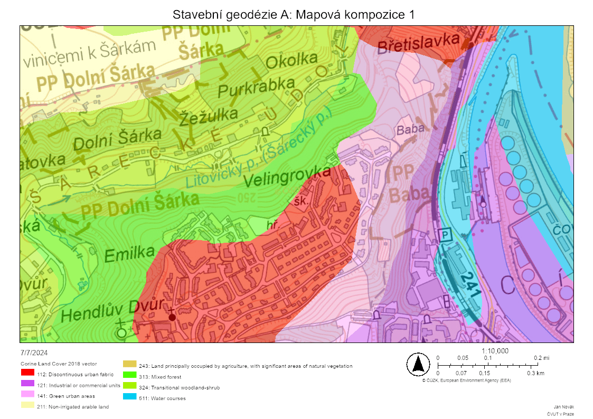

# Práce s webovými mapovými službami

## Cíle cvičení

 <!-- specificky format gridu (trida "grid_icon_info") na miru uvodni strance predmetu -->

-   :fontawesome-regular-handshake:{ .xl }

    __seznámení s prostředím__ webového systému ArcGIS&nbsp;Online

-   :material-layers-triple-outline:{ .xl }

    __shrnutí datových zdrojů__ webových mapových vrstev

-   :material-map-outline:{ .xl }

    __přidávání dat do mapy__ (ze serverů různých poskytovatelů)

-   :material-map-marker-plus-outline:{ .xl }

    __extrakce informací__ z více vrstev ke konkrétnímu místu

## Princip webových mapových služeb

Webové mapové služby jsou __webové nástroje poskytující geoprostorová data__ ze serveru na klienta __prostřednictvím internetu__. Klientem je (zjednodušeně) zařízení uživatele vysílající požadavek pro získání dat ze serveru. V praxi se většinou __klient služby dotazuje pomocí GIS aplikace__ (webové či desktopové), která na pozadí posílá serveru požadavky a následně zobrazuje přijatá data (viz obrázek). Díky vazbě dat na souřadnicový systém lze takto __kombinovat data s různými rozsahy a z různých zdrojů v jednom mapovém okně__ a data se zobrazí polohově správně.

{ .no-filter width=700px}
{align=center}

Pro webové mapové služby existují různé __standardy komunikace__. Nerozšířenějším je tzv. __WMS__ (Web Map Service) vyvinutý mezinárodní standardizační organizací Open Geospatial Consortium (OGC). Stadard je otevřený a snadno použitelný. Kromě WMS existuje např. také proprietární stadard společnosti Esri (provozovatel platformy ArcGIS Online) – tzv. ArcGIS REST.

## Geoportály

Lorem ipsum dolor sit amet, consectetuer adipiscing elit. Maecenas porttitor congue massa. Fusce posuere, magna sed pulvinar ultricies, purus lectus malesuada libero, sit amet commodo magna eros quis urna. Nunc viverra imperdiet enim. Fusce est. Vivamus a tellus. Pellentesque habitant morbi tristique senectus et netus et malesuada fames ac turpis egestas. Proin pharetra nonummy pede. Mauris et orci. Aenean nec lorem. In porttitor. Donec laoreet nonummy augue. Suspendisse dui purus, scelerisque at, vulputate vitae, pretium mattis, nunc. Mauris eget neque at sem venenatis eleifend. Ut nonummy.
{style="color:grey;"}

__Tipy na některé zajímavé geoportály:__

[Geoportál ČÚZK](https://geoportal.cuzk.cz/ "Český úřad zeměměřický a katastrální"){ .md-button .md-button--primary .button_smaller .external_link_icon target="_blank"}
[Geoportál AOPK](https://gis-aopkcr.opendata.arcgis.com/ "Agentura přírody a krajiny"){ .md-button .md-button--primary .button_smaller .external_link_icon target="_blank"}
[Geoportál ČSÚ](https://geodata.statistika.cz/portal/apps/sites/#/homepage "Český statistický úřad"){ .md-button .md-button--primary .button_smaller .external_link_icon target="_blank"}
[Geoportál Praha](https://geoportalpraha.cz/ "IPR Praha"){ .md-button .md-button--primary .button_smaller .external_link_icon target="_blank"}
[Geoportál města Brna](https://data.brno.cz/ "Magistrát města Brna"){ .md-button .md-button--primary .button_smaller .external_link_icon target="_blank"}
{.button_array}

## ArcGIS Online

Lorem ipsum dolor sit amet, consectetuer adipiscing elit. Maecenas porttitor congue massa. Fusce posuere, magna sed pulvinar ultricies, purus lectus malesuada libero, sit amet commodo magna eros quis urna. Nunc viverra imperdiet enim. Fusce est. Vivamus a tellus. Pellentesque habitant morbi tristique senectus et netus et malesuada fames ac turpis egestas. Proin pharetra nonummy pede. Mauris et orci. Aenean nec lorem. In porttitor. Donec laoreet nonummy augue. Suspendisse dui purus, scelerisque at, vulputate vitae, pretium mattis, nunc. Mauris eget neque at sem venenatis eleifend. Ut nonummy.
{style="color:grey;"}

## Atributy geoprostorových dat

Podstatnou částí geoprostorových dat jsou atributy. Jedná se o __doplňkové informace přiřazené ke každému prvku__ a uspořádané ve formě tzv. __atributové tabulky__. Sloupce této tabulky jsou tzv. __:octicons-columns-16: atributy__, řádky jsou tzv. __:octicons-rows-16: záznamy__. Každý atribut má svůj název a datový typ (např. celé číslo, des. číslo, text, datum). V záznamu nemusí být nutně vyplněny všechny atributy (záleží na nastavení databáze).

{width=50% .no-filter}
{align="center"}

Zobrazování atributů konkrétního prvku probíhá nejčastěji formou tzv. __vyskakovacího okna__ (pop-up window). Tento prvek uživatelského rozhraní se __objeví po kliknutí na prvek v mapě__ a ve výchozím stavu zobrazuje __tabulku s atributy pro daný prvek__.

{width=50% .no-filter}
{align="center"}
<figcaption>vyskakovací okno (po kliknutí na prvek)</figcaption>

Atributy se v geomatice používají pro __filtrování prvků__ (zobrazení/skrytí) nebo __řízení symbologie__ (např. obarvení budov podle počtu podlaží).

???+ task-fg-color "Příklad: Atributová tabulka a vyskakovací okna"

    <iframe width="100%" height="400" frameborder="0" scrolling="no" marginheight="0" marginwidth="0" src="https://experience.arcgis.com/experience/0d0ade6e797e419d8e73fd28b8704c5a"></iframe>

<!--
style="border: .05rem solid #ededed; border-radius: .1rem;"-->

## Zadání úlohy

Je dán __bod o zeměpisných souřadnicích__ dle individuálního zadání (viz níže). S využitím __mapové prohlížečky ArcGIS Online__, __mapových služeb__ či __geoportálů__ o zadaném bodu zjistěte:

1. __příslušnost k obci__ a v jakém __katastrálním území__ bod leží

    - využijte vrstev __:material-layers: Obec__{.bg title="podvrstva  a KatastralniUzemi"} a __:material-layers: KatastralniUzemi__{.bg} z [__Geoportálu ČÚZK__](https://geoportal.cuzk.cz/){.color_def .underlined_dotted .external_link_icon target="_blank"} (prohlížecí služba databáze RÚIAN).

---

2. __geologické podloží__ pod zadaným bodem (hornina / horninový typ)

    - využijte vhodné vrstvy ze stránek [__České geologické služby__](https://cgs.gov.cz/ "Webové služby → geologie (27) → Geologická mapa 1 : 50 000 (GEOČR50)"){.color_def .underlined_dotted .external_link_icon target="_blank"}

---

3. adresu nejbližšího __adresního bodu__

    - využijte vrstvy __:material-layers: AdresniMisto__{.bg} z [__Geoportálu ČÚZK__](https://geoportal.cuzk.cz/){.color_def .underlined_dotted .external_link_icon target="_blank"} (prohlížecí služba databáze RÚIAN).

---

4. poštovní směrovací číslo nejbližšího __poštovního úřadu__

    - využijte vrstvy __:material-layers: Pobočky České pošty__{.bg} od [__České informační agentury životního prostředí__](https://gis.cenia.cz/geoserver/pobocky_ceske_posty/wfs?SERVICE=WFS&request=GETCapabilities "adresu odkazu lze přímo použít jako mapovou vrstvu"){.color_def .underlined_dotted .external_link_icon target="_blank"} (CENIA) s nastaveným __filtrem__{.color_def .underlined_dotted title="Hodnoty filtru: &#34;Podávací&#34;, &#34;Samostatná pošta Partner&#34;, &#34;Dodejna I&#34;, &#34;Dodejna II&#34;, &#34;Samostatná dodejna&#34;" target="_blank"}.

---

5. __nadmořskou výšku lokality__

    - výšku odečtěte ze __tří různých mapových podkladů__{.primary_color} a __výsledky porovnejte__
    - doporučenými zdroji jsou např. 
    [__Základní topografické mapy ČR__](https://ags.cuzk.cz/geoprohlizec/ "obsahují vrstevnice s popisy výšky"){.color_def .underlined_dotted .external_link_icon target="_blank"}, webová aplikace 
    [__Analýzy výškopisu__](https://ags.cuzk.cz/av/ "režim Výpis souřadnic bodu"){.color_def .underlined_dotted .external_link_icon target="_blank"} 
    (ČÚZK) nebo mapový portál 
    [__Mapy.cz__](https://mapy.cz/ "funkce Měření → Výškový profil"){.color_def .underlined_dotted .external_link_icon target="_blank"}

---

6. k jaké __změně využití území__ v zadaném bodě došlo mezi lety 1990 a 2018 (__uveďte kategorie__ Land Cover pro obě období a jejich __porovnání__)

    - využijte data evropského programu [__Copernicus__](https://www.copernicus.eu/cs "program EU pro družicové pozorování Země v zájmu obecného užitku všech občanů"){.color_def .underlined_dotted .external_link_icon target="_blank"} – __:material-layers: Corine Land Cover Europe__{.bg .color_def target="_blank"}
    - dostupné ze stránek &nbsp;[__Evropské agentury pro životní prostředí (EEA)__](https://land.copernicus.eu/en/products/corine-land-cover?tab=main){ .color_def .underlined_dotted .external_link_icon target="_blank"}&nbsp; či &nbsp;[__Copernicus Land Monitoring Service (CLMS)__](https://www.eea.europa.eu/en/datahub/datahubitem-view/a5144888-ee2a-4e5d-a7b0-2bbf21656348){ .color_def .underlined_dotted .external_link_icon target="_blank"}

---

7. ~~zda dochází v lokalitě k překročení hodnoty 20 µg/m³ u roční průměrné koncentrace suspendovaných prachových částic PM10 a jakých hodnot v ng/m³ dosahují roční průměrné koncentrace benzoapyrenu (použijte službu III_5_7_8_CHMU_ovzdusi z ArcGIS Online, vrstva ČHMÚ ovzduší – Koncentrace látek znečišťujících ovzduší v gridu 1x1 km, rok 2019)~~

    - ~~využijte vrstvy od [__České informační agentury životního prostředí__](https://gis.cenia.cz/geoserver/chmu_ovzdusi/wfs?SERVICE=WFS&request=GETCapabilities "adresu odkazu lze přímo použít jako mapovou vrstvu"){.color_def .underlined_dotted .external_link_icon target="_blank"} (CENIA).~~

---

7. jaké hodnoty dosahovala v zadané lokalitě __intenzita světelného znečištění__ v roce 2022

    - využijte vrstvy __:material-layers: Světelné znečištění v ČR za rok 2022__{.bg} od [__České informační agentury životního prostředí__](https://tiledimageservices2.arcgis.com/LlQJoYHf9cwrM7NJ/arcgis/rest/services/raster01_final3crf/ImageServer "adresu odkazu lze přímo použít jako mapovou vrstvu"){.color_def .underlined_dotted .external_link_icon target="_blank"} (CENIA). <figcaption>(vrstva byla přepublikována pro účely výuky – odkaz proto nevede přímo na server agentury CENIA)</figcaption>

    <!--  Puvodni vrstva ZDE: https://gis.cenia.cz/geoserver/svetelne_znecisteni/wms?service=WMS&request=GetCapabilities  -->

---

8. příslušnost zadané lokality ke __stavebnímu a matričnímu úřadu__

    - využijte vrstvy __:material-layers: Působnost úřadů__{.bg} od [__České informační agentury životního prostředí__](https://gis.cenia.cz/geoserver/pusobnost_uradu/wfs?SERVICE=WFS&request=GETCapabilities "adresu odkazu lze přímo použít jako mapovou vrstvu"){.color_def .underlined_dotted .external_link_icon target="_blank"} (CENIA).

---

<!--
DALŠÍ TIPY (nalezeno na Cenii):

Světelné znečištění: https://gis.cenia.cz/geoserver/svetelne_znecisteni/wms?service=WMS&request=GetCapabilities
Úřady: https://gis.cenia.cz/geoserver/pusobnost_uradu/wms?service=WMS&request=GetCapabilities
Školy a školská zařízení: https://gis.cenia.cz/geoserver/skoly/wms?service=WMS&request=GetCapabilities
Pobočky České pošty (je tam problém, že to bere i Pošta Partner, Balíkovny a jiná místa): https://gis.cenia.cz/geoserver/pobocky_ceske_posty/wms?service=WMS&request=GetCapabilities
Ovzduší: https://gis.cenia.cz/geoserver/chmu_ovzdusi/wms?service=WMS&request=GetCapabilities

Další zajímavé vrstvy zde (ale mám problém s popupem!): https://gis.cenia.cz/geoserver/ows?service=WMS&version=1.3.0&request=GetCapabilities

ALE POZOR! VSECHNY TY VRSTVY MAJI I WFS A TA FUNGUJE!!!
STACI PREPSAT NA: https://gis.cenia.cz/geoserver/pobocky_ceske_posty/wfs?SERVICE=WFS&request=GETCapabilities
WFS jede v AGOLu i v Geoprohlizeci (paradoxne v Procku to ma trochu problemy)

zde zajimava informace o WMS: https://community.esri.com/t5/arcgis-api-for-silverlight-questions/direct-link-to-wms-sub-layer/td-p/171686

-->

&nbsp;

__Dále vytvořte a vyexportujte mapové kompozice:__

<!-- div je zde kvuli anotacim -->

9. využití území dle __:material-layers: CORINE Land Cover 2018__{.bg} nad __:material-layers: Základní topografickou mapou__{.bg} , __měřítko kompozice 1 : 10 000__ __(1)__{title="ukázka řešení"}

    - Základní topografická mapa je k dispozici např. na [__Geoportálu ČÚZK__](https://geoportal.cuzk.cz/ "Služby → Prohlížecí → Esri ArcGIS Server (nebo WMS)"){.color_def .underlined_dotted .external_link_icon target="_blank"}
    - výchozí podkladová mapa ArcGIS Online __není součástí správného výsledku__{.primary_color}. Pro správný výsledek je nutné podkladovou mapu změnit na oficiální „Základní topografickou mapu“ od Zeměměřického úřadu.

---

10. nejbližšího __maloplošného chráněného území__{.underlined_dotted title="přír. památka, přír. rezervace, nár. přír. památka, nár. přír. rezervace"} přírody (nikoli okolí Vašeho bodu, ale okolí chráněného území) __s popiskem__{.primary_color} nad __:material-layers: Základní topografickou mapou__{.bg} , __měřítko kompozice 1 : 10 000__ __(2)__{title="ukázka řešení"}

    - využijte vrstvu z [__Geoportálu Agentury ochrany přírody a krajiny ČR__](https://gis-aopkcr.opendata.arcgis.com/){.color_def .underlined_dotted .external_link_icon target="_blank"} (AOPK)
    - výchozí podkladová mapa ArcGIS Online __není součástí správného výsledku__{.primary_color}. Pro správný výsledek je nutné podkladovou mapu změnit na oficiální „Základní topografickou mapu“ od Zeměměřického úřadu.

1.  { .no-filter width=700px} vytvořeno nástrojem Print v ArcGIS Online
2.  { .no-filter width=700px} vytvořeno nástrojem Print v ArcGIS Online

---

K vytvoření kompozic využijte platformu 
[__ArcGIS Online__](https://www.arcgis.com/ "pouze v ArcGIS Online lze nastavit přesné měřítko"){.color_def .underlined_dotted .external_link_icon target="_blank"}, 
[__Geoprohlížeč ČÚZK__](https://ags.cuzk.cz/geoprohlizec/){.color_def .underlined_dotted .external_link_icon target="_blank"} či 
[__Národní geoportál INSPIRE__](https://geoportal.gov.cz/web/guest/about-inspire){.color_def .underlined_dotted .external_link_icon target="_blank"} 
a __příslušné datové vrstvy__. Vrstvy prolněte __pomocí nástrojů průhlednosti vrstev__. Kompozice exportujte do obrázku (funkce Print) a __vložte do technické zprávy__.

??? task-fg-color "Individuální zadání"

    | číslo zadání |      jméno      | zeměpisná šířka | zeměpisná délka |
    | ------------ | --------------- | --------------- | --------------- |
    |   1 |          Abrahámová Anna | 50° 40' 43,046" | 13° 57' 19,464" |
    |   2 |            Al Homsi Muaz | 50° 34' 34,184" | 16° 14' 50,813" |
    |   3 | Aschenbrennerová Natalie | 50° 52' 34,389" | 14° 29' 11,485" |
    |   4 |            Bagirova Sona | 49° 06' 06,627" | 16° 13' 27,818" |
    |   5 |         Bártová Kristýna | 50° 41' 33,743" | 15° 34' 30,465" |
    |   6 |           Bařinová Adéla | 50° 13' 25,238" | 14° 36' 38,118" |
    |   7 |        Bělohradský David | 49° 06' 31,394" | 16° 58' 22,678" |
    |   8 |       Belyavskaya Galina | 50° 18' 48,187" | 14° 09' 23,383" |
    |   9 |               Beneš Adam | 49° 46' 16,237" | 14° 06' 50,982" |
    |  10 |           Beranová Klára | 49° 30' 14,516" | 14° 56' 03,058" |
    |  11 |             Berka Matyáš | 49° 20' 08,770" | 15° 35' 48,571" |
    |  12 |         Berndtová Eliška | 49° 06' 33,595" | 16° 15' 01,624" |
    |  13 |           Bitsman Sofiia | 49° 06' 23,316" | 16° 59' 58,777" |
    |  14 |            Bodlák Ondřej | 49° 20' 18,479" | 18° 08' 57,115" |
    |  15 |             Bodnar Pavlo | 49° 26' 26,879" | 17° 58' 36,673" |
    |  16 |              Boschat Lea | 49° 33' 07,231" | 17° 26' 16,875" |
    |  17 |      Bovsunivska Tetiana | 49° 40' 02,665" | 18° 47' 03,983" |
    |  18 |          Bunčeková Adéla | 50° 12' 13,632" | 17° 23' 48,027" |
    |  19 |        Burešová Michaela | 49° 54' 30,559" | 17° 04' 37,640" |
    |  20 |              Buzický Vít | 50° 02' 38,936" | 16° 40' 13,131" |
    |  21 |        Candrová Michaela | 50° 13' 07,113" | 16° 33' 03,676" |
    |  22 |       Cikánková Karolína | 50° 27' 17,867" | 15° 59' 54,862" |
    |  23 |              Danda Tomáš | 50° 43' 58,758" | 15° 49' 18,906" |
    |  24 |            Davtyan Davit | 50° 38' 05,545" | 15° 24' 25,822" |
    |  25 |      Dlhopolčková Nicole | 50° 59' 37,450" | 15° 09' 19,717" |
    |  26 |         Dovhanyčová Nina | 50° 47' 45,550" | 15° 07' 04,989" |
    |  27 |         Drajnová Róberta | 49° 49' 23,670" | 13° 13' 16,337" |
    |  28 |       Drapáková Kateřina | 49° 36' 07,223" | 14° 10' 30,200" |
    |  29 |         Dubrovska Karyna | 50° 01' 29,066" | 15° 29' 02,069" |
    |  30 |          Dupčáková Daria | 51° 00' 44,513" | 14° 28' 55,502" |
    |  31 |       Durdíková Kateřina | 50° 35' 56,519" | 13° 34' 18,542" |
    |  32 |        Durecová Viktória | 50° 09' 31,326" | 12° 29' 41,641" |
    |  33 |         Dvořáčková Beata | 49° 52' 01,461" | 14° 28' 27,751" |
    |  34 |         Dvořák František | 50° 22' 38,390" | 17° 06' 45,621" |
    |  35 |             Edinac Oxana | 49° 16' 49,578" | 15° 44' 24,199" |
    |  36 |            Fiala Vojtěch | 48° 34' 29,438" | 14° 18' 46,350" |
    |  37 |           Fousková Alice | 49° 00' 19,505" | 13° 34' 52,622" |
    |  38 |              Fučík Karel | 49° 36' 57,126" | 12° 48' 45,586" |
    |  39 |              Gintner Jan | 50° 26' 38,173" | 13° 36' 29,796" |
    |  40 |             Guryča Šimon | 50° 10' 45,425" | 14° 44' 40,003" |
    |  41 |           Hájková Eliška | 50° 34' 34,184" | 16° 14' 50,813" |
    |  42 |              Haken Tomáš | 50° 48' 53,318" | 14° 46' 26,549" |
    |  43 |           Hartová Zuzana | 50° 37' 38,590" | 14° 45' 34,261" |
    |  44 |         Havlátová Blanka | 50° 40' 43,046" | 13° 57' 19,464" |
    |  45 |         Havlíček Antonín | 50° 52' 34,389" | 14° 29' 11,485" |
    |  46 |            Helclová Sára | 49° 06' 06,627" | 16° 13' 27,818" |
    |  47 |             Hodek Michal | 50° 41' 33,743" | 15° 34' 30,465" |
    |  48 |            Holubec Jakub | 50° 13' 25,238" | 14° 36' 38,118" |
    |  49 |             Horák Samuel | 49° 06' 31,394" | 16° 58' 22,678" |
    |  50 |          Houžvička Matěj | 50° 18' 48,187" | 14° 09' 23,383" |
    |  51 |             Hozlár Matej | 49° 46' 16,237" | 14° 06' 50,982" |
    |  52 |            Hvězdová Anna | 49° 30' 14,516" | 14° 56' 03,058" |
    |  53 |      Chalupníková Eliška | 49° 20' 08,770" | 15° 35' 48,571" |
    |  54 |             Chobot Sláva | 49° 06' 33,595" | 16° 15' 01,624" |
    |  55 |          Chuprina Elvira | 49° 06' 23,316" | 16° 59' 58,777" |
    |  56 |           Chuprova Elena | 49° 20' 18,479" | 18° 08' 57,115" |
    |  57 |         Iakimov Miroslav | 49° 26' 26,879" | 17° 58' 36,673" |
    |  58 |        Iefremenko Maryna | 49° 33' 07,231" | 17° 26' 16,875" |
    |  59 |            Jágrik Marian | 49° 40' 02,665" | 18° 47' 03,983" |
    |  60 |                Janák Jan | 50° 12' 13,632" | 17° 23' 48,027" |
    |  61 |                 Jíra Jan | 49° 54' 30,559" | 17° 04' 37,640" |
    |  62 |           Kaľavská Petra | 50° 02' 38,936" | 16° 40' 13,131" |
    |  63 |       Kalinina Margarita | 50° 13' 07,113" | 16° 33' 03,676" |
    |  64 |         Kalousková Adéla | 50° 27' 17,867" | 15° 59' 54,862" |
    |  65 |     Karabaeva Anastasiia | 50° 43' 58,758" | 15° 49' 18,906" |
    |  66 |           Karlová Simona | 50° 38' 05,545" | 15° 24' 25,822" |
    |  67 |              Khalak Yana | 50° 59' 37,450" | 15° 09' 19,717" |
    |  68 |          Kiseleva Marina | 50° 47' 45,550" | 15° 07' 04,989" |
    |  69 |         Klačanová Monika | 49° 49' 23,670" | 13° 13' 16,337" |
    |  70 |             Klapka Lukáš | 49° 36' 07,223" | 14° 10' 30,200" |
    |  71 |             Klaus Robert | 50° 01' 29,066" | 15° 29' 02,069" |
    |  72 |              Klika Tomáš | 51° 00' 44,513" | 14° 28' 55,502" |
    |  73 |      Kocmanová Magdalena | 50° 35' 56,519" | 13° 34' 18,542" |
    |  74 |          Kocourek Štěpán | 50° 09' 31,326" | 12° 29' 41,641" |
    |  75 |          Kohoutek Ondřej | 49° 52' 01,461" | 14° 28' 27,751" |
    |  76 |         Kolková Michaela | 50° 22' 38,390" | 17° 06' 45,621" |
    |  77 |        Končelová Marcela | 49° 16' 49,578" | 15° 44' 24,199" |
    |  78 |      Körblerová Karolína | 48° 34' 29,438" | 14° 18' 46,350" |
    |  79 |               Král Kamil | 49° 00' 19,505" | 13° 34' 52,622" |
    |  80 |          Králiková Aneta | 49° 36' 57,126" | 12° 48' 45,586" |
    |  81 |            Kreuzová Emma | 50° 26' 38,173" | 13° 36' 29,796" |
    |  82 |          Krupička Václav | 50° 10' 45,425" | 14° 44' 40,003" |
    |  83 |            Kubias Matouš | 50° 34' 34,184" | 16° 14' 50,813" |
    |  84 |              Kušej Pavel | 50° 48' 53,318" | 14° 46' 26,549" |
    |  85 |         Kyseľová Martina | 50° 37' 38,590" | 14° 45' 34,261" |
    |  86 |          Laibl Christian | 50° 40' 43,046" | 13° 57' 19,464" |
    |  87 |       Leissnerová Anežka | 50° 52' 34,389" | 14° 29' 11,485" |
    |  88 |          Lekešová Zuzana | 49° 06' 06,627" | 16° 13' 27,818" |
    |  89 |              Leník Milan | 50° 41' 33,743" | 15° 34' 30,465" |
    |  90 |          Lindaur Vojtěch | 50° 13' 25,238" | 14° 36' 38,118" |
    |  91 |       Listíková Michaela | 49° 06' 31,394" | 16° 58' 22,678" |
    |  92 |         Listíková Tereza | 50° 18' 48,187" | 14° 09' 23,383" |
    |  93 |              Liška Jakub | 49° 46' 16,237" | 14° 06' 50,982" |
    |  94 |          Loudová Vendula | 49° 30' 14,516" | 14° 56' 03,058" |
    |  95 |         Lysiakova Polina | 49° 20' 08,770" | 15° 35' 48,571" |
    |  96 |         Mackovčin Viliam | 49° 06' 33,595" | 16° 15' 01,624" |
    |  97 |              Mágrová Eva | 49° 06' 23,316" | 16° 59' 58,777" |
    |  98 |           Machů Michaela | 49° 20' 18,479" | 18° 08' 57,115" |
    |  99 |             Maléřová Eva | 49° 26' 26,879" | 17° 58' 36,673" |
    | 100 |            Maslák Daniel | 49° 33' 07,231" | 17° 26' 16,875" |
    | 101 |             Mikuda Tomáš | 49° 40' 02,665" | 18° 47' 03,983" |
    | 102 |     Mlynárová Anna-Marie | 50° 12' 13,632" | 17° 23' 48,027" |
    | 103 |          Molinková Karin | 49° 54' 30,559" | 17° 04' 37,640" |
    | 104 |     Morgensternová Lucie | 50° 02' 38,936" | 16° 40' 13,131" |
    | 105 |                Muk Filip | 50° 13' 07,113" | 16° 33' 03,676" |
    | 106 |         Němcová Karolína | 50° 27' 17,867" | 15° 59' 54,862" |
    | 107 |         Němečková Eliška | 50° 43' 58,758" | 15° 49' 18,906" |
    | 108 |        Neveršilová Klára | 50° 38' 05,545" | 15° 24' 25,822" |
    | 109 |          Neznamova Nelli | 50° 59' 37,450" | 15° 09' 19,717" |
    | 110 |      Nguyenová Quynh Hoa | 50° 47' 45,550" | 15° 07' 04,989" |
    | 111 |            Nikolaev Oleg | 49° 49' 23,670" | 13° 13' 16,337" |
    | 112 |             Novák Martin | 49° 36' 07,223" | 14° 10' 30,200" |
    | 113 |        Nováková Kateřina | 50° 01' 29,066" | 15° 29' 02,069" |
    | 114 |           Novotná Tereza | 51° 00' 44,513" | 14° 28' 55,502" |
    | 115 |           Padevět Štěpán | 50° 35' 56,519" | 13° 34' 18,542" |
    | 116 |            Páleník Filip | 50° 09' 31,326" | 12° 29' 41,641" |
    | 117 |         Panznerová Lucie | 49° 52' 01,461" | 14° 28' 27,751" |
    | 118 |           Pekárek Martin | 50° 22' 38,390" | 17° 06' 45,621" |
    | 119 |         Peukertova Aneta | 49° 16' 49,578" | 15° 44' 24,199" |
    | 120 |           Pham Son Duong | 48° 34' 29,438" | 14° 18' 46,350" |
    | 121 |           Picková Tereza | 49° 00' 19,505" | 13° 34' 52,622" |
    | 122 |          Plášilová Julie | 49° 36' 57,126" | 12° 48' 45,586" |
    | 123 |         Pokorná Kateřina | 50° 26' 38,173" | 13° 36' 29,796" |
    | 124 |          Pořízková Klára | 50° 10' 45,425" | 14° 44' 40,003" |
    | 125 |           Prášková Klára | 50° 34' 34,184" | 16° 14' 50,813" |
    | 126 |           Prášková Marie | 50° 48' 53,318" | 14° 46' 26,549" |
    | 127 |         Procházka Martin | 49° 36' 57,126" | 12° 48' 45,586" |
    | 128 |       Procházková Monika | 50° 26' 38,173" | 13° 36' 29,796" |
    | 129 |             Přibyl Matěj | 50° 10' 45,425" | 14° 44' 40,003" |
    | 130 |       Reicheltová Sabina | 50° 34' 34,184" | 16° 14' 50,813" |
    | 131 |             Rydval Tomáš | 50° 48' 53,318" | 14° 46' 26,549" |
    | 132 |         Rychlíková Marie | 50° 37' 38,590" | 14° 45' 34,261" |
    | 133 |              Říha Martin | 50° 40' 43,046" | 13° 57' 19,464" |
    | 134 |           Saitzová Julie | 50° 52' 34,389" | 14° 29' 11,485" |
    | 135 |              Saxová Anna | 49° 06' 06,627" | 16° 13' 27,818" |
    | 136 |             Sazima Lukáš | 50° 41' 33,743" | 15° 34' 30,465" |
    | 137 |       Selnekovičová Anna | 50° 13' 25,238" | 14° 36' 38,118" |
    | 138 |            Sgibneva Lada | 49° 06' 31,394" | 16° 58' 22,678" |
    | 139 |       Shkrabo Anastasiia | 50° 18' 48,187" | 14° 09' 23,383" |
    | 140 |             Sloupová Eva | 49° 46' 16,237" | 14° 06' 50,982" |
    | 141 |         Smutková Barbora | 49° 30' 14,516" | 14° 56' 03,058" |
    | 142 |             Socha Ondřej | 49° 20' 08,770" | 15° 35' 48,571" |
    | 143 |           Součková Julia | 49° 06' 33,595" | 16° 15' 01,624" |
    | 144 |       Stejskalová Tereza | 49° 06' 23,316" | 16° 59' 58,777" |
    | 145 |        Střihavková Lucie | 49° 20' 18,479" | 18° 08' 57,115" |
    | 146 |               Suchá Anna | 49° 26' 26,879" | 17° 58' 36,673" |
    | 147 |             Suprun Alisa | 49° 33' 07,231" | 17° 26' 16,875" |
    | 148 |            Sychrová Anna | 49° 40' 02,665" | 18° 47' 03,983" |
    | 149 |               Šich Tomáš | 50° 12' 13,632" | 17° 23' 48,027" |
    | 150 |        Šmejkal Jan Jakub | 49° 54' 30,559" | 17° 04' 37,640" |
    | 151 |              Šmida Filip | 50° 02' 38,936" | 16° 40' 13,131" |
    | 152 |           Štefko Nicolas | 50° 13' 07,113" | 16° 33' 03,676" |
    | 153 |        Tenglerová Tereza | 50° 27' 17,867" | 15° 59' 54,862" |
    | 154 |              Teplý Filip | 50° 43' 58,758" | 15° 49' 18,906" |
    | 155 |        Terekhova Tetiana | 50° 38' 05,545" | 15° 24' 25,822" |
    | 156 |            Tomková Aneta | 50° 59' 37,450" | 15° 09' 19,717" |
    | 157 |               Touš Lukáš | 50° 47' 45,550" | 15° 07' 04,989" |
    | 158 |            Trnková Lucie | 49° 49' 23,670" | 13° 13' 16,337" |
    | 159 |           Trojáček Lukáš | 49° 36' 07,223" | 14° 10' 30,200" |
    | 160 |           Trousil Matyáš | 50° 01' 29,066" | 15° 29' 02,069" |
    | 161 |       Tsaizel Anastasiia | 51° 00' 44,513" | 14° 28' 55,502" |
    | 162 |           Typlová Tereza | 50° 35' 56,519" | 13° 34' 18,542" |
    | 163 |          Uherková Tereza | 50° 09' 31,326" | 12° 29' 41,641" |
    | 164 |        Vaculová Gabriela | 49° 52' 01,461" | 14° 28' 27,751" |
    | 165 |              Vajc Daniel | 50° 22' 38,390" | 17° 06' 45,621" |
    | 166 |           Valenta Tadeáš | 49° 16' 49,578" | 15° 44' 24,199" |
    | 167 |         Vaňková Viktorie | 48° 34' 29,438" | 14° 18' 46,350" |
    | 168 |              Vavra Jakub | 49° 00' 19,505" | 13° 34' 52,622" |
    | 169 |      Velichinskaia Daria | 49° 36' 57,126" | 12° 48' 45,586" |
    | 170 |          Vojtěchová Anna | 50° 26' 38,173" | 13° 36' 29,796" |
    | 171 |            Vokatý Martin | 50° 10' 45,425" | 14° 44' 40,003" |
    | 172 |             Volfová Jana | 50° 34' 34,184" | 16° 14' 50,813" |
    | 173 |          Vopalecká Lucie | 50° 48' 53,318" | 14° 46' 26,549" |
    | 174 |         Vůchová Veronika | 49° 36' 57,126" | 12° 48' 45,586" |
    | 175 |    Zakaurtseva Ekaterina | 50° 26' 38,173" | 13° 36' 29,796" |
    | 176 |           Zemanová Aneta | 50° 10' 45,425" | 14° 44' 40,003" |
    | 177 |             Zonyga Šimon | 50° 34' 34,184" | 16° 14' 50,813" |

## Odevzdání

Povinným výstupem úlohy je __technická zpráva v elektronické podobě__ odevzdaná v termínu prostřednictvím systému __Moodle__.

Úloha je uznána, pokud technická zpráva obsahuje __všechny požadované náležitosti__ (viz níže) a má __správný formát__ (PDF).

???+ note-grey "Požadované náležitosti technické zprávy"
    - Formát odevzdání __:material-file: PDF__, název souboru __U3-Prijmeni-Jmeno.pdf__{.no-dec .outlined}, případně __U3-Prijmeni-Jmeno-oprava01.pdf__{.no-dec .outlined}
    - Rozpiska se __jménem__, __názvem úlohy__, __individuálním číslem zadání__ a __souřadnicemi zadaného bodu__
    - __Odpovědi__ na všechny otázky v zadání úlohy __včetně zdrojů__ – __jako zdroj nelze uvést pouze "ArcGIS Online" – tato služba je pouze prohlížečka, uvedení jako zdroj proto nedává smysl. Zdrojem získaných informací jsou konkrétní datové vrstvy – na ty lze odkazovat jejich přesným názvem a URL adresou služby.__{style="color:#c22521;" .icon-exclm .no-dec}
    - __Grafické přílohy__ dle zadání (podúlohy __9__{.no-dec .outlined} a __10__{.no-dec .outlined} )
    - __Závěr__ s krátkým (3-6 vět) objektivním hodnocením výsledků úlohy. Lze např. zhodnotit, proč jsou některé výsledky takové, jaké jsou. Nebo zmínit využití podobné úlohy ve vašem oboru.

### Opravy

V případě, že odevzdaný výstup není správný, je vyučujícím emailem __vrácen k opravě__. Opravený výstup se odevzdává opět prostřednictvím systému Moodle. Výstup lze odevzdat po __maximálně dvou opravách__, v případě pozdního odevzdání či nesprávného výstupu po druhé opravě je úloha __trvale označena jako nesplněná__.

[Tabulka hodnocení úloh](../hodnoceni.md){ .md-button .md-button--primary }
{align=center}

     

