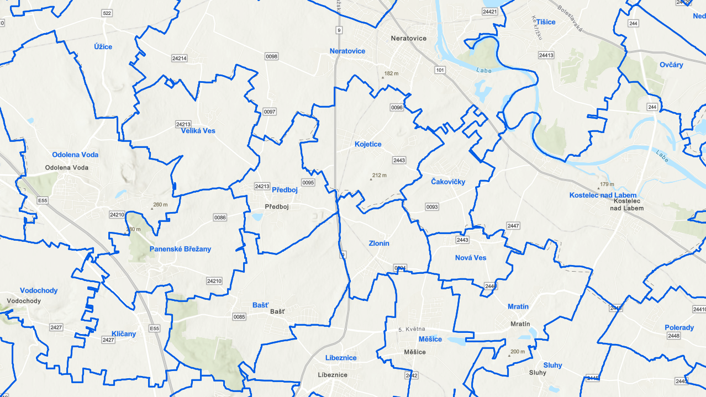
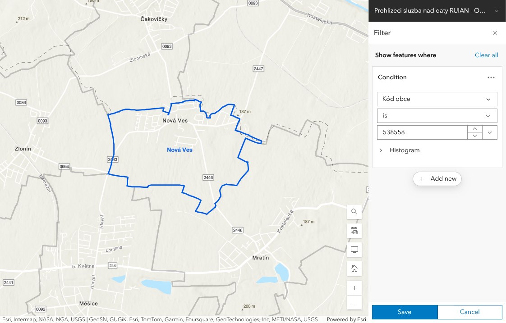
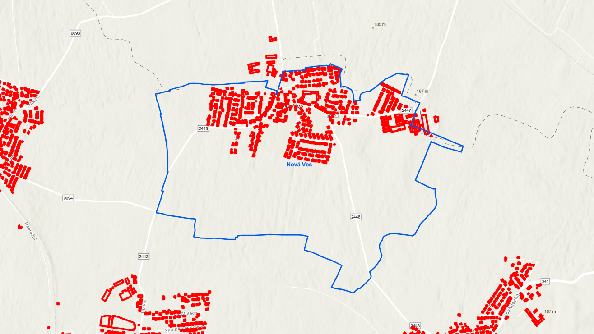
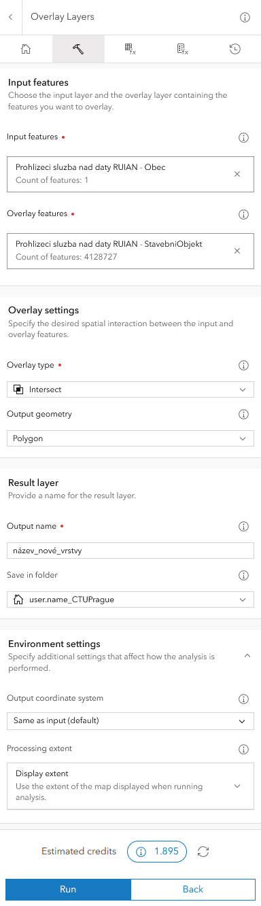
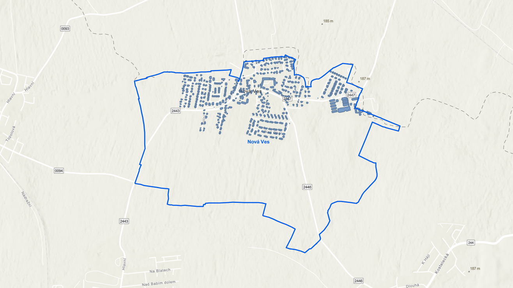
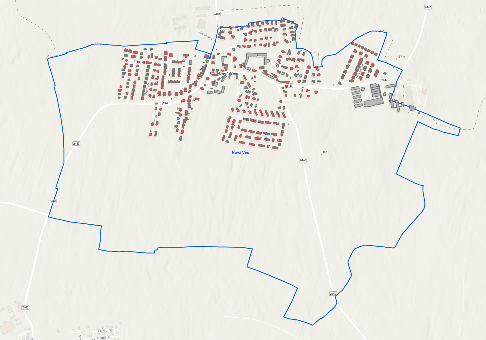
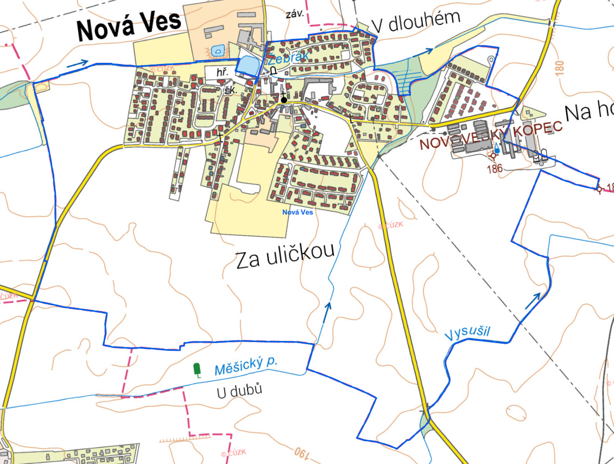
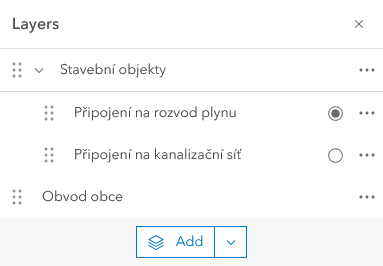

# Tvorba webové mapy, export dat

## Cíle cvičení

 <!-- specificky format gridu (trida "grid_icon_info") na miru uvodni strance predmetu -->

-   :material-map-search-outline:{ .xl }

    vytvoření __interaktivní webové mapy__ s vlastním obsahem

-   :material-chart-box-multiple:{ .xl }

    procvičení jednoduchých __GIS analýz__

-   :material-map-marker-multiple-outline:{ .xl }

    nastavení základní __mapové symbologie__

-   :material-export:{ .xl }

    __export dat__ pro použití v CAD software

## Základní topografická mapa a ZABAGED

Lorem ipsum dolor sit amet, consectetuer adipiscing elit. Maecenas porttitor congue massa. Fusce posuere, magna sed pulvinar ultricies, purus lectus malesuada libero, sit amet commodo magna eros quis urna. Nunc viverra imperdiet enim. Fusce est. Vivamus a tellus. Pellentesque habitant morbi tristique senectus et netus et malesuada fames ac turpis egestas. Proin pharetra nonummy pede. Mauris et orci. Aenean nec lorem. In porttitor. Donec laoreet nonummy augue. Suspendisse dui purus, scelerisque at, vulputate vitae, pretium mattis, nunc. Mauris eget neque at sem venenatis eleifend. Ut nonummy.
{style="color:grey;"}

## Zadání úlohy

Pomocí mapových služeb od ČÚZK vytvořte __webovou mapu__ obsahující budovy (stavební objekty) v zadané obci __barevně rozlišené dle připojení na kanalizaci a plyn__.

??? task-fg-color "Individuální zadání"

    <iframe src="https://docs.google.com/spreadsheets/d/1RBCJ99r4Xq0sgOieYuvZmkfEJvFj48Goe-jzcNbt9sA/htmlview?gid=1316296044" width="100%" height="500" frameBorder="0"></iframe>

## Pracovní postup

- Do prázdné mapy v ArcGIS Online __přidejte vrstvu__ __:material-layers: RÚIAN__{.bg}, __podvrstvu__ __:material-layers-triple: Obec__{.bg} z [__Geoportálu ČÚZK__](https://geoportal.cuzk.cz/ "Služby → Prohlížecí → Esri ArcGIS Server (nebo WMS)"){.color_def .underlined_dotted .external_link_icon target="_blank"}. Tato vrstva obsahuje polygony území všech obcí v ČR.__(1)__{title="ukázka"}

- Vrstvě __nastavte :material-filter: filtr dle kódu__ (v krajním případě dle názvu) __zadané obce__. Filtr omezí zobrazení prvků pouze na jednu zadanou obec.__(2)__{title="ukázka"}

- Do mapy dále __přidejte vrstvu__ __:material-layers: RÚIAN__{.bg}, __podvrstvu__ __:material-layers-triple: StavebniObjekt__{.bg} z [__Geoportálu ČÚZK__](https://geoportal.cuzk.cz/ "Služby → Prohlížecí → Esri ArcGIS Server (nebo WMS)"){.color_def .underlined_dotted .external_link_icon target="_blank"}. Tato vrstva obsahuje polygony všech stavebních objektů v ČR.__(3)__{title="ukázka"}

- __Prostorovou analýzou__ (nástroj __:material-tools: Overlay Layers__{.bg}) __vytvořte vrstvu stavebních objektů pouze na území zadané obce__.__(4)__{title="nastavení parametrů nástroje"}__(5)__{title="ukázka výsledku"}

    - nastavte mapové okno tak, aby byla __viditelná celá hranice zadané obce__ a *parametr __"Processing Extent"__ nastavte na __"Display Extent"__*{.primary_color .no-dec} (parametr omezí výpočet na rozsah mapového okna, výrazně se tím sníží cena výpočtu)

- Pomocí stylů __nastavte budovám symbologii dle atributu "Připojení na kanalizační síť"__. Kategorie typu `nedefinováno`, `nezjištěno`, `null`, `žádná hodnota` apod. musí mít nastavenou __neutrální šedou barvu__{.primary_color} (dle kartografických zvyklostí). Barvy výplně zvolte dle citu, volitelně přidejte i barevné ohraničení.__(6)__{title="ukázka"}

- Vrstvu duplikujte a nově vytvořené kopii __nastavte symbologii dle atributu "Připojení na rozvod plynu"__. V seznamu vrstev __změňte číselné kategorie na slovní popisy__{.primary_color} dle následujícího klíče:

 <!-- https://squidfunk.github.io/mkdocs-material/reference/grids/#using-generic-grids -->

__:material-pipe: Připojení na kanalizační síť__
{align="center" style="margin:0px;"}

|KÓD| NÁZEV                     |
|---|---------------------------|
| 1 | Přípoj na kanalizační síť |
| 2 | Vlastní ČOV               |
| 3 | Žumpa, jímka, septik      |
| 4 | Bez kanalizace a jímky    |
| 8 | Nedefinováno              |
| 9 | Nezjištěno                |

__:material-gas-burner: Připojení na rozvod plynu__
{align="center" style="margin:0px;"}

|KÓD| NÁZEV                |
|---|----------------------|
| 1 |Plyn z veřejné sítě   |
| 2 |Plyn z dom. zásobníku |
| 3 |Bez plynu             |
| 8 |Nedefinováno          |
| 9 |Nezjištěno            |
| 51|Plyn v domě           |

- Přidejte __Základní topografickou mapu (S-JTSK)__ od ČÚZK či __ortofoto (S-JTSK)__ od ČÚZK __jako podkladovou mapu__{.primary_color}.__(7)__{title="ukázka"}

    - Aby se vrstva přidala jako podkladová mapa (Basemap), je nutné ji přidat tlačítkem __:material-button-cursor: Použít jako podkladovou mapu__{.bg} (Use a basemap)
    - Nastavením podkladové mapy v souřadnicovém systému JTSK dojde ke správnému zarovnání budov s podkladovou mapou.

<!-- NEFUNGUJE MI TA ZMENA PROJEKCE, U TETO VRSTVY TO TREBA FUNGUJE: geoappext.nrcan.gc.ca/arcgis/rest/services/BaseMaps/CBMT3978/MapServer -->

- Vrstvám s klasifikací budov __nastavte exkluzivní viditelnost__{.primary_color .underlined_dotted title="funguje pouze na seskupené vrstvy"}, aby byla při přepínání viditelná vždy pouze jedna z nich. Zachovejte viditelnost vrstvy s obvodem obce, __ostatní vrstvy z mapy odstraňte__{.primary_color}.__(8)__{title="ukázka"}

- __Webovou mapu uložte__ s názvem "Jmeno_Prijmeni_SGEA2025" a __nastavte sdílení v rámci oganizace__{.primary_color} nebo __veřejné__{.primary_color}.

- Vyučujícímu odevzdejte __URL adresu webové mapy__.__(9)__

???+ task-fg-color "Výstup cvičení (část první): Webová mapa (ukázka)"

    <iframe width="100%" height="400" frameborder="0" scrolling="no" marginheight="0" marginwidth="0" src="https://experience.arcgis.com/experience/0e6a7769af1d479489af74e2f98ca195"></iframe>

<!--

{width=500px}
{align=center}
<figcaption>ukázka správného výsledku (webová mapa)</figcaption>

-->

---

- ~~Obě vrstvy (stavební objekty i obvod zadané obce) __exportujte do formátu Shapefile__ a __stáhněte na disk počítače__.~~

- ~~Shapefile __konvertujte do formátu DXF__. Použijte například [tento](https://mygeodata.cloud/converter/shp-to-dxf){.color_def .underlined_dotted .external_link_icon target="_blank"} webový nástroj.~~

- ~~Konvertovaný soubor otevřete v CAD software a __vytvořte jednoduchý výkres__ obsahující pouze __obvod zadané obce__ a (jinou barvou) __obvody stavebních objektů__ v ní. Všechny objekty musí být ve formě linií. Výkres odevzdejte ve formátu PDF.~~

- Obě vrstvy (stavební objekty i obvod zadané obce) otevřete v programu __:simple-autocad: AutoCAD__ (pomocí doplňku [ArcGIS for AutoCAD](https://www.esri.com/en-us/arcgis/products/arcgis-for-autocad/overview){.color_def .underlined_dotted .external_link_icon target="_blank"})

- Vytvořte __jednoduchý výkres__ – kresbě nastavte __vhodnou symbologii__, přidejte __text s názvem obce__  a __exportujte do PDF__ (formát stránky A4), tento __výstup odevzdejte__.

???+ task-fg-color "Výstup cvičení (část druhá): Výkres (ukázka)"

    <iframe src="https://drive.google.com/file/d/1MSAjhVjESNXBqnbiRNS2tz16X78QGy1Q/preview" width="100%" height="400" style="border:0;"></iframe>

- Pomocí :simple-arcgis: ArcGIS Pro (desktopová verze platformy ArcGIS, mimo rozsah kurzu) lze CAD výkres generovat s rozlišením vrstev dle atributu (tedy například rozlišit stavební objekty dle připojení na kanalizační síť i v CAD výkresu)
<!--

{width=500px}
{align=center}
<figcaption>ukázka správného výsledku (CAD výkres)</figcaption>

-->

 <!-- pro anotace -->

1.  { .no-filter width=700px} vrstva "RÚIAN/Obec"
2.  { .no-filter width=700px} filtr dle kódu obce
3.  { .no-filter width=700px} vrstva "RÚIAN/StavebniObjekt"
4.  { .no-filter width=200px}  parametry nástroje "Overlay Layers"
5.  { .no-filter width=700px} výsledná vrstva (budovy jsou pouze uvnitř hraice obce)
6.  { .no-filter width=700px} změna symbologie (barva výplně a obrysu)
7.  { .no-filter width=700px} změna podkladové mapy (Základní topografická mapa)
8.  { .no-filter width=700px} exkluzivní viditelnost skupiny vrstev v legendě
9.  __Příklad odevzdaného odkazu:__ https://ctuprague.maps.arcgis.com/apps/mapviewer/index.html?webmap=21df15ae2ca9458794a16a8fd9078b78

## Výstupy cvičení

Povinnými výstupy úlohy jsou __webová mapa__{.outlined} a __CAD výkres__{.outlined}. Webová mapa je po uložení a nastavení sdílení přístupná přes __URL adresu__, kterou je nutné odevzdat vyučujícímu. Spolu s CAD výkresem je tyto výstupy __nutné odevzdat přes systém Moodle__.

Úloha je uznána, pokud webová mapa a CAD výkres obsahují __všechny požadované náležitosti__ (viz níže).

???+ note-grey "Požadované náležitosti odevzdaných výstupů"
    __Webová mapa__

    - vrstva se stavebními objekty __omezena hranicí obce__, naopak žádné __stavební objekty nesmí chybět__
    - __legenda se slovními popisy__ (nikoli s číselnými kódy)
    - kategorie typu "nedefinováno", "nezjištěno" apod. neutrální __šedou barvou__
    - podkladová mapa – __Základní topografická mapa__ nebo __Ortofoto od Zeměměřického úřadu__
    - na vrstvy rozlišující připojení na kanalizaci a plyn nastavená __exkluzivní viditelnost__ (nesmí být možné je zobrazit současně)
    - sdílení webové mapy nastaveno __"v rámci organizace"__ či __"veřejně"__, __bez správného sdílení k mapě nemá vyučující přístup a nedojde ke kontrole__{style="color:#c22521;" .icon-exclm .no-dec}

    __CAD výkres__

    - __formát PDF__
    - obsahem musí být __pouze hranice obce__ a __stavební objekty__ (omezené hranicí obce)
    - hranice obce __barevně odlišena__ od stavebních objektů
    - __název obce__ stejnou barvou jako hranice obce

### Opravy

V případě, že odevzdaný výstup není správný, je vyučujícím emailem __vrácen k opravě__. Opravený výstup se odevzdává opět prostřednictvím systému Moodle. Výstup lze odevzdat po __maximálně dvou opravách__, v případě pozdního odevzdání či nesprávného výstupu po druhé opravě je úloha __trvale označena jako nesplněná__{style="color:#c22521;"}.

[Tabulka hodnocení úloh](../hodnoceni.md){ .md-button .md-button--primary }
{align=center}

     

<!--

-->