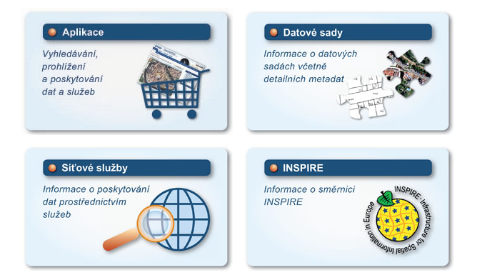

# Souhrn datových zdrojů

Při práci s GIS je velmi podstatné mít __kvalitní a spolehlivá data__ (za co nejnižší cenu). Naštěstí je v dnešní době v mnoha organizacích už zvykem geoprostorová data poskytovat __veřejně a zdarma__. Na této stránce se snažíme nabídnout __tipy na různá zajímavá data__ včetně možností jejich získání.

## Geoportál ČÚZK

Český úřad zeměměřický a katastrální nabízí data otevřená (tzn. dostupná zdarma) i poskytovaná za úplatu. Data sdružuje na svém __Geoportálu__{.color_def .underlined_dotted .external_link_icon target="_blank"}.

Geoportál se dělí na __:material-button-cursor: Aplikace__{.bg}, __:material-button-cursor: Datové sady__{.bg} a __:material-button-cursor: Síťové služby__{.bg}

{ width=700px}
{align=center}

## Geoportál Praha

## Geoportál AOPK